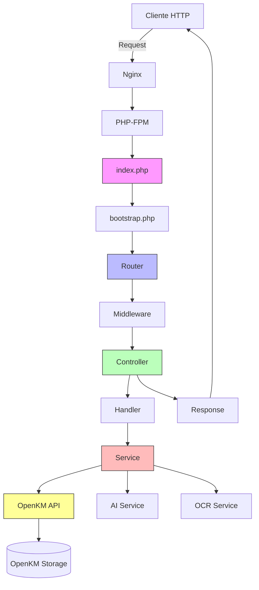

# 01 - Arquitectura y Estructura del Proyecto

**Proyecto:** RUND API v2.0
**Documento:** Arquitectura y Estructura
**Fecha:** Octubre 2025
**Autor:** Oliver Castelblanco Martínez

---

## Tabla de Contenidos

1. [Visión General](#visión-general)
2. [Estructura de Directorios](#estructura-de-directorios)
3. [Patrón Arquitectónico](#patrón-arquitectónico)
4. [Componentes Principales](#componentes-principales)
5. [Flujo de Ejecución](#flujo-de-ejecución)
6. [Sistema de Autoloading](#sistema-de-autoloading)
7. [Convenciones y Estándares](#convenciones-y-estándares)

---

## Visión General

RUND-API es una API RESTful moderna desarrollada en **PHP 8.3+** que proporciona servicios de gestión documental para el sistema RUND (Registro Único Nacional Docente) de la ESAP.

### Características Principales

- **Arquitectura RESTful:** Endpoints bien definidos con recursos claros
- **Patrón MVC en capas:** Separación Controllers → Handlers → Services
- **PSR-4 Autoloading:** Namespace `RUND\` con Composer
- **Strict Types:** Declaración estricta en todos los archivos PHP
- **Integración OpenKM:** Repositorio documental como backend de storage
- **Servicios externos:** AI (Ollama) y OCR (PaddleOCR)
- **Documentación OpenAPI:** Swagger UI integrado

### Tecnologías Core

| Tecnología | Versión | Uso |
|------------|---------|-----|
| PHP | 8.3+ | Backend principal |
| Composer | 2.0+ | Gestión de dependencias |
| OpenKM | - | Storage documental (Java/Tomcat) |
| LibreOffice | 25.8+ | Conversión DOCX → PDF |
| Nginx | - | Servidor web (contenedor Docker) |

---

## Estructura de Directorios

### Árbol Completo del Proyecto

```
rund-api/
├── app/
│   ├── src/                          # Código fuente PSR-4
│   │   ├── Config/                   # Configuración
│   │   │   └── Config.php            # Constantes y rutas OpenKM
│   │   ├── Controllers/              # Controladores
│   │   │   ├── BaseController.php    # Clase base para controllers
│   │   │   └── V2/                   # Controllers API v2
│   │   │       ├── AIController.php
│   │   │       ├── ArchivosController.php
│   │   │       ├── CategoriasController.php
│   │   │       ├── CertificadosController.php
│   │   │       ├── DocumentosController.php
│   │   │       ├── FirmasController.php
│   │   │       ├── ListadosController.php
│   │   │       ├── ProfesoresController.php
│   │   │       └── SystemController.php
│   │   ├── Core/                     # Núcleo del sistema
│   │   │   ├── OpenKM.php            # Cliente API REST OpenKM
│   │   │   ├── Router.php            # Sistema de enrutamiento
│   │   │   └── Utils.php             # Utilidades globales
│   │   ├── Handlers/                 # Lógica de peticiones HTTP
│   │   │   ├── AIHandlers.php
│   │   │   ├── CategoriasHandlers.php
│   │   │   ├── CertificadosHandlers.php
│   │   │   ├── DataHandlers.php
│   │   │   ├── FileHandlers.php
│   │   │   └── FirmasHandlers.php
│   │   ├── Legacy/                   # Código v1 (deprecated)
│   │   │   ├── AIController.php
│   │   │   ├── CategoriasController.php
│   │   │   ├── CertificadosController.php
│   │   │   ├── CompatibilityAliases.php
│   │   │   ├── DataController.php
│   │   │   ├── DeprecationMiddleware.php
│   │   │   ├── FileController.php
│   │   │   ├── FirmasController.php
│   │   │   └── SystemController.php
│   │   ├── Middleware/               # Middleware HTTP
│   │   │   ├── AuthMiddleware.php
│   │   │   ├── CorsMiddleware.php
│   │   │   └── ValidationMiddleware.php
│   │   └── Services/                 # Lógica de negocio
│   │       ├── AIService.php
│   │       ├── CategoriasService.php
│   │       ├── CertificadosService.php
│   │       ├── DocumentService.php
│   │       ├── FirmasService.php
│   │       ├── LBService.php         # LibreOffice Service
│   │       ├── QRService.php
│   │       └── ReportesService.php
│   ├── bootstrap.php                 # Inicialización de la aplicación
│   ├── index.php                     # Punto de entrada principal
│   └── routes_v2.php                 # Definición de rutas v2
├── docker/                           # Configuración Docker
├── docs/                             # Documentación técnica
│   ├── 00_INDICE_DOCUMENTACION.md
│   ├── 01_ARQUITECTURA_Y_ESTRUCTURA.md
│   └── inst_doc.md                   # Instrucciones de análisis
├── logs/                             # Archivos de log
├── static/                           # Archivos estáticos
│   └── swagger-ui.html               # Interfaz Swagger
├── tmp/                              # Archivos temporales
├── vendor/                           # Dependencias de Composer
├── .env                              # Variables de entorno (desarrollo)
├── .env.example                      # Template de variables
├── .gitignore
├── composer.json                     # Dependencias PHP
├── composer.lock
├── Dockerfile                        # Imagen Docker
├── nginx-fix.conf                    # Configuración Nginx
└── README.md                         # Documentación general
```

### Descripción de Directorios Principales

#### `/app/src/` - Código Fuente

**Config/**
- `Config.php`: Constantes del sistema (rutas OpenKM, credenciales, directorios)

**Controllers/**
- `BaseController.php`: Clase abstracta base con métodos comunes
- `V2/`: Controladores RESTful modernos (9 controllers)

**Core/**
- `OpenKM.php`: Cliente completo para API REST de OpenKM
- `Router.php`: Sistema de enrutamiento con soporte para parámetros dinámicos
- `Utils.php`: 11 métodos estáticos de utilidad

**Handlers/**
- Capa intermedia entre Controllers y Services
- Procesan requests HTTP específicos
- Orquestan llamadas a múltiples services

**Services/**
- Lógica de negocio pura
- Métodos estáticos reutilizables
- Sin dependencia de HTTP

**Middleware/**
- Procesamiento pre-controller
- Validaciones, CORS, autenticación
- Implementan patrón callable

**Legacy/**
- Código API v1 (mantenido por compatibilidad)
- **Estado:** Deprecado, usar solo V2

#### `/app/` - Aplicación

- `index.php`: Entry point, catch global de errores
- `bootstrap.php`: Autoloader, CORS, configuración PHP
- `routes_v2.php`: Configuración de rutas con Router

#### Otros Directorios

- `docker/`: Configuración de contenedores
- `docs/`: Documentación técnica generada
- `logs/`: Logs de errores y acceso
- `static/`: Swagger UI y assets
- `tmp/`: Archivos temporales (QR, plantillas, certificados)
- `vendor/`: Dependencias Composer (autoload, librerías)

---

## Patrón Arquitectónico

### MVC con Capa de Servicios

RUND-API implementa una arquitectura en **4 capas**:

```
┌─────────────────────────────────────────┐
│  1. ROUTER (Core/Router.php)            │
│  - Mapeo de URLs a Controllers          │
│  - Ejecución de Middleware              │
│  - Manejo de respuestas                 │
└─────────────────┬───────────────────────┘
                  │
┌─────────────────▼───────────────────────┐
│  2. CONTROLLERS (Controllers/V2/)       │
│  - Validación básica de parámetros      │
│  - Orquestación de Handlers             │
│  - Formateo de respuestas HTTP          │
└─────────────────┬───────────────────────┘
                  │
┌─────────────────▼───────────────────────┐
│  3. HANDLERS (Handlers/)                │
│  - Procesamiento de requests HTTP       │
│  - Lógica específica de endpoints       │
│  - Coordinación de múltiples Services   │
└─────────────────┬───────────────────────┘
                  │
┌─────────────────▼───────────────────────┐
│  4. SERVICES (Services/)                │
│  - Lógica de negocio pura               │
│  - Reutilizables en múltiples contextos │
│  - Independientes de HTTP               │
└─────────────────┬───────────────────────┘
                  │
        ┌─────────┴──────────┐
        │                    │
┌───────▼────────┐  ┌────────▼────────┐
│  OpenKM Core   │  │  External APIs  │
│  (Storage)     │  │  (AI/OCR)       │
└────────────────┘  └─────────────────┘
```

### Ejemplo de Flujo Completo

**Petición:** `GET /api/v2/profesores/12345678`

```
1. Nginx recibe request → PHP-FPM → index.php
   ↓
2. bootstrap.php inicializa (autoload, CORS)
   ↓
3. Router::dispatch() busca ruta
   ↓
4. Ejecuta CorsMiddleware (si configurado)
   ↓
5. Llama ProfesoresController::show(['cedula' => '12345678'])
   ↓
6. Controller valida parámetro 'cedula'
   ↓
7. Llama DataHandlers::getInfoProfesor('12345678')
   ↓
8. Handler llama DocumentService::getInfoArchivosProfesor('12345678')
   ↓
9. Service consulta OpenKM::consulta('search/find?...')
   ↓
10. OpenKM retorna JSON con archivos del profesor
   ↓
11. Service procesa categorías y estructura respuesta
   ↓
12. Handler retorna al Controller
   ↓
13. Controller formatea con successResponse()
   ↓
14. Router convierte a JSON y envía headers
   ↓
15. Cliente recibe JSON con datos del profesor
```

---

## Componentes Principales

### 1. Router (`Core/Router.php`)

**Responsabilidades:**
- Mapeo de URLs a Controllers
- Soporte para parámetros dinámicos (`{id}`, `{cedula}`)
- Ejecución de middleware (global y por ruta)
- Conversión de respuestas a JSON/binario
- Manejo de 404

**Métodos Clave:**
```php
public function get(string $path, callable|array $handler, array $middleware = []): self
public function post(string $path, callable|array $handler, array $middleware = []): self
public function group(string $prefix, callable $callback): self
public function dispatch(): void
```

**Ejemplo de Uso:**
```php
// En routes_v2.php
$router->group('/api/v2', function (Router $router) {
    $router->get('/profesores/{cedula}', [ProfesoresController::class, 'show']);
});
```

### 2. BaseController (`Controllers/BaseController.php`)

**Responsabilidades:**
- Clase abstracta para todos los controllers
- Métodos de utilidad HTTP
- Validación de parámetros requeridos
- Formateo consistente de respuestas

**Métodos Protegidos:**
```php
protected function getPostData(): ?array
protected function getQueryParams(): array
protected function getFiles(): array
protected function validateRequired(array $data, array $required): array
protected function errorResponse(string $message, int $code = 400): array
protected function successResponse(array $data = [], string $message = null): array
protected function fileResponse(callable $fileHandler): ?array
```

### 3. OpenKM Client (`Core/OpenKM.php`)

**Responsabilidades:**
- Cliente completo para API REST de OpenKM
- Operaciones CRUD en repositorio documental
- Sistema de versionado (checkout/checkin)
- Búsqueda y navegación de carpetas/documentos

**Métodos Públicos Principales:**
```php
public static function consulta(string $consulta, string $tipo = "GET", ...): string
public static function getArchivo(string $uuid): string
public static function cargaArchivo(array $archivo, array $propiedades, string $path, ...): array
public static function borraArchivo(string $uuid): string
public static function creaCarpetas(array $rutas, string $prefijo): array
public static function getDataFile(string $nombre, string $ruta = ...): array
public static function getImageFile(string $nombre, string $ruta = ...): void
```

**Conexión:**
```php
// Configurado en Config.php
const USER = "okmAdmin";
const PASSWORD = "admin";
const REST = "/services/rest/";

// Usado en OpenKM::consulta()
curl_setopt($curl, CURLOPT_HTTPAUTH, CURLAUTH_BASIC);
curl_setopt($curl, CURLOPT_USERNAME, Config::USER);
curl_setopt($curl, CURLOPT_PASSWORD, Config::PASSWORD);
```

### 4. Utils (`Core/Utils.php`)

**Responsabilidades:**
- Funciones de utilidad global
- Conversiones y transformaciones de datos
- Validaciones comunes
- Helpers para CORS y arrays

**Métodos Disponibles:**
```php
public static function cors(): void
public static function getCoincidencias(array $array1, array $array2): array
public static function esArraySimple(array|null $array): bool
public static function textoAnombreCarpeta(string $texto): string
public static function extraeElemento(array $array, string $campo, string $busqueda): array|null
public static function arrayMatch(array $array, string $fragmento): bool
public static function csvToJsonByColumns(array $csvArray): string
public static function generaID(array $actualData = []): string
public static function borrarMultiplesArchivos(string $nombre): array
public static function buscarPorId(array $array, string $id): array|null
public static function getLabels(array $obj): string
```

### 5. Middleware System

**Tipos de Middleware:**

1. **Global Middleware** (aplicado a todas las rutas)
   ```php
   $router->addGlobalMiddleware(CorsMiddleware::handle(...));
   ```

2. **Route-specific Middleware** (aplicado a rutas específicas)
   ```php
   $router->post('/archivos/subir', [...], [
       ValidationMiddleware::requireFiles(['archivo'])
   ]);
   ```

**Middleware Disponibles:**
- `AuthMiddleware`: Autenticación y autorización (placeholder)
- `CorsMiddleware`: Headers CORS
- `ValidationMiddleware`: Validaciones HTTP (métodos, parámetros, archivos, tamaños)

---

## Flujo de Ejecución

### 1. Inicialización (`bootstrap.php`)

```php
// Líneas 1-20 de bootstrap.php
require_once __DIR__ . '/../vendor/autoload.php';  // Autoload Composer

ini_set('display_errors', '1');
error_reporting(E_ALL ^ (E_NOTICE | E_WARNING | E_DEPRECATED));

// Habilitar CORS desde el inicio
RUND\Core\Utils::cors();

// Cargar variables de entorno (si existe .env)
if (file_exists(__DIR__ . '/../.env')) {
    // Carga variables de entorno
}
```

### 2. Entry Point (`index.php`)

```php
// Líneas 14-47 de index.php
declare(strict_types=1);

require_once __DIR__ . '/bootstrap.php';
require_once __DIR__ . '/routes_v2.php';

use RUND\Core\Router;

try {
    $router = new Router();
    setupRoutesV2($router);  // Configura rutas desde routes_v2.php
    $router->dispatch();      // Procesa request actual
} catch (Throwable $e) {
    // Manejo global de errores
    http_response_code(500);
    header('Content-Type: application/json; charset=utf-8');

    error_log("RUND API Error: " . $e->getMessage() . " in " . $e->getFile() . ":" . $e->getLine());

    echo json_encode([
        'error' => 'Error interno del servidor',
        'message' => 'Ha ocurrido un error inesperado'
    ], JSON_UNESCAPED_UNICODE | JSON_PRETTY_PRINT);
}
```

### 3. Configuración de Rutas (`routes_v2.php`)

```php
// Líneas 38-122 de routes_v2.php
function setupRoutesV2(Router $router): void
{
    // Grupo v2 - Nueva API RESTful
    $router->group('/api/v2', function (Router $router) {

        // Sistema
        $router->group('/system', function (Router $router) {
            $router->get('/info', [SystemController::class, 'getInfo']);
            $router->get('/health', [SystemController::class, 'getHealth']);
            // ... más rutas
        });

        // Certificados
        $router->group('/certificados', function (Router $router) {
            $router->get('/{id}', [CertificadosController::class, 'show']);
            $router->post('/generar', [CertificadosController::class, 'generar']);
            // ... más rutas
        });

        // ... más grupos
    });
}
```

### 4. Procesamiento del Request

#### Router::dispatch()

```php
// Líneas 99-131 de Router.php
public function dispatch(): void
{
    $method = $_SERVER['REQUEST_METHOD'];
    $uri = parse_url($_SERVER['REQUEST_URI'], PHP_URL_PATH);
    $path = $this->normalizePath($uri);

    // 1. Ejecutar middleware global
    foreach ($this->middleware as $middleware) {
        $result = $middleware($method, $path);
        if ($result === false) return; // Middleware interrumpió
    }

    // 2. Buscar ruta coincidente
    $route = $this->findRoute($method, $path);
    if (!$route) {
        $this->handleNotFound();
        return;
    }

    // 3. Ejecutar middleware específico de la ruta
    foreach ($route['middleware'] as $middleware) {
        $result = $middleware($method, $path, $route['params']);
        if ($result === false) return;
    }

    // 4. Ejecutar el handler
    $this->executeHandler($route);
}
```

#### Controller Execution

```php
// Ejemplo: ProfesoresController::show()
public function show(array $params = []): array
{
    // 1. Validar parámetros
    if (!isset($params['cedula'])) {
        return $this->errorResponse('Cédula es requerida', 400);
    }

    // 2. Llamar a Handler
    $profesor = DataHandlers::getInfoProfesor($params['cedula']);

    // 3. Formatear respuesta
    return $this->successResponse([
        'profesor' => $profesor,
        'cedula' => $params['cedula'],
        'meta' => [
            'version' => '2.0'
        ]
    ]);
}
```

### 5. Manejo de Respuestas

#### Router::handleResponse()

```php
// Líneas 242-263 de Router.php
private function handleResponse($result): void
{
    if ($result === null) {
        // Handler se encargó de la respuesta (archivos, redirects)
        return;
    }

    if (is_array($result)) {
        header('Content-Type: application/json; charset=utf-8');
        echo json_encode($result, JSON_UNESCAPED_UNICODE | JSON_PRETTY_PRINT);
    } elseif (is_string($result)) {
        if (!headers_sent() && !headers_list()) {
            header('Content-Type: text/plain; charset=utf-8');
        }
        echo $result;
    } else {
        header('Content-Type: application/json; charset=utf-8');
        echo json_encode(['data' => $result], JSON_UNESCAPED_UNICODE | JSON_PRETTY_PRINT);
    }
}
```

---

## Sistema de Autoloading

### PSR-4 con Composer

**Configuración en `composer.json`:**
```json
{
    "autoload": {
        "psr-4": {
            "RUND\\": "app/src/"
        }
    }
}
```

**Mapeo de Namespaces:**
```
RUND\Controllers\V2\SystemController
  ↓
app/src/Controllers/V2/SystemController.php

RUND\Services\CertificadosService
  ↓
app/src/Services/CertificadosService.php

RUND\Core\OpenKM
  ↓
app/src/Core/OpenKM.php
```

**Uso en Código:**
```php
<?php
declare(strict_types=1);

namespace RUND\Controllers\V2;

use RUND\Controllers\BaseController;
use RUND\Handlers\DataHandlers;

class ProfesoresController extends BaseController
{
    // ... código
}
```

**Regenerar Autoloader:**
```bash
composer dump-autoload
```

---

## Convenciones y Estándares

### Nomenclatura

**Archivos:**
- Controllers: `NombreController.php` (PascalCase)
- Services: `NombreService.php`
- Handlers: `NombreHandlers.php` (plural)
- Configuración: `Config.php` (singular)

**Clases:**
- PascalCase: `SystemController`, `OpenKM`, `QRService`
- Una clase por archivo
- Nombre de archivo = Nombre de clase

**Métodos:**
- camelCase: `getInfo()`, `subirArchivo()`, `generaReporte()`
- Públicos: Accesibles externamente
- Privados/Protegidos: Helpers internos

**Variables:**
- camelCase: `$postData`, `$nombreArchivo`, `$uuid`
- Constantes: UPPER_SNAKE_CASE: `Config::ROOT_TAX`, `Config::TEMP_DIR`

### Declaraciones PHP

**Strict Types (obligatorio):**
```php
<?php

declare(strict_types=1);

namespace RUND\Services;
```

**Type Hints (recomendado):**
```php
public function getInfo(array $params = []): array
{
    return $this->successResponse([...]);
}

public static function consulta(string $consulta, string $tipo = "GET"): string
{
    // ...
}
```

### Estructura de Archivos

**Header Estándar:**
```php
<?php

/**
 * RUND API v2 - Nombre del Componente
 *
 * Descripción breve del propósito del archivo.
 *
 * @author ESAP Development Team / Oliver Castelblanco Martínez
 * @version 2.0
 * @since PHP 8.3
 */

declare(strict_types=1);

namespace RUND\Controllers\V2;

use RUND\Controllers\BaseController;
// ... más imports

class NombreController extends BaseController
{
    // ... código
}
```

### Respuestas HTTP

**Formato JSON Estándar:**
```json
{
  "campo1": "valor",
  "campo2": 123,
  "meta": {
    "version": "2.0",
    "timestamp": "2025-10-20 10:30:00"
  }
}
```

**Errores:**
```json
{
  "error": "Descripción del error",
  "missing": ["campo1"],
  "required": ["campo1", "campo2"]
}
```

**Success:**
```json
{
  "data": { ... },
  "message": "Operación exitosa",
  "meta": { ... }
}
```

### Comentarios y Documentación

**PHPDoc para métodos públicos:**
```php
/**
 * Genera un certificado a partir de una plantilla Word
 *
 * @param string $nombrePlantilla Nombre de la plantilla
 * @param array $estructura Array con bloques de contenido
 * @param string $id ID del certificado para QR
 * @param string $ruta Ruta en OpenKM (default: plantillas certificados)
 * @return TemplateProcessor Objeto con el certificado generado
 */
public static function creaCertificado(
    string $nombrePlantilla,
    array $estructura,
    string $id,
    string $ruta = Config::TAX_PLANTILLAS_CERTIFICADOS
): TemplateProcessor {
    // ...
}
```

---

## Diagrama de Arquitectura General



---

## Próximos Pasos

Para entender en detalle:
- **Endpoints:** Ver `02_ENDPOINTS_API.md`
- **Services:** Ver `03_SERVICIOS_Y_HANDLERS.md`
- **OpenKM:** Ver `04_INTEGRACION_OPENKM.md`
- **Seguridad:** Ver `07_SEGURIDAD_Y_VALIDACIONES.md`

---

**Última actualización:** 2025-10-20
**Versión del documento:** 1.0
