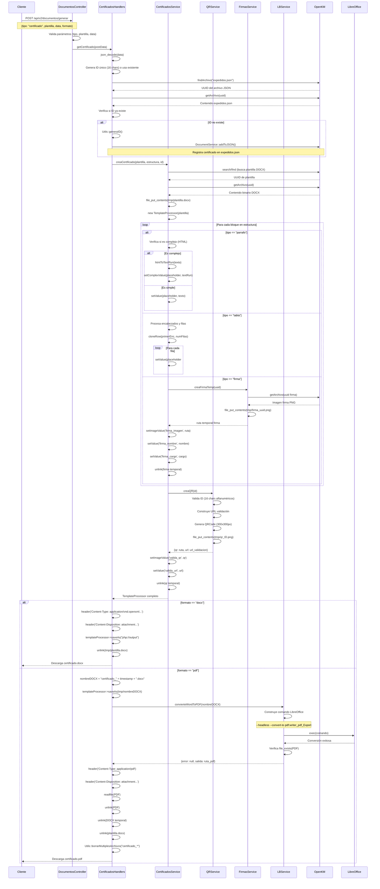
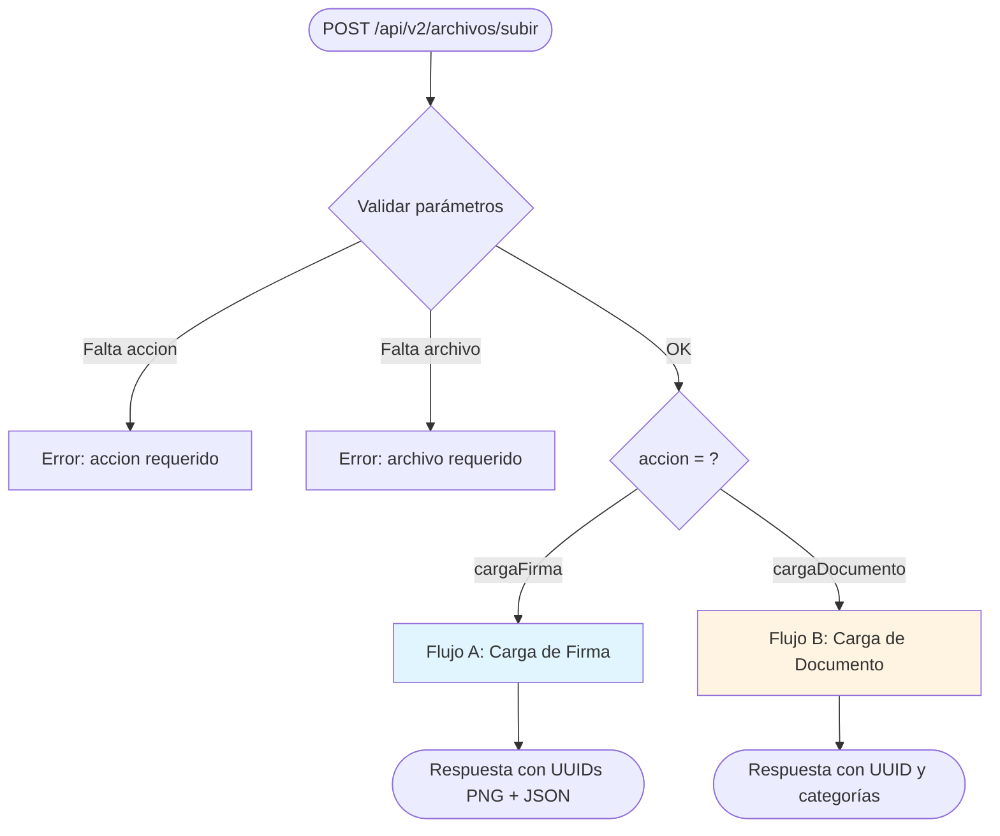
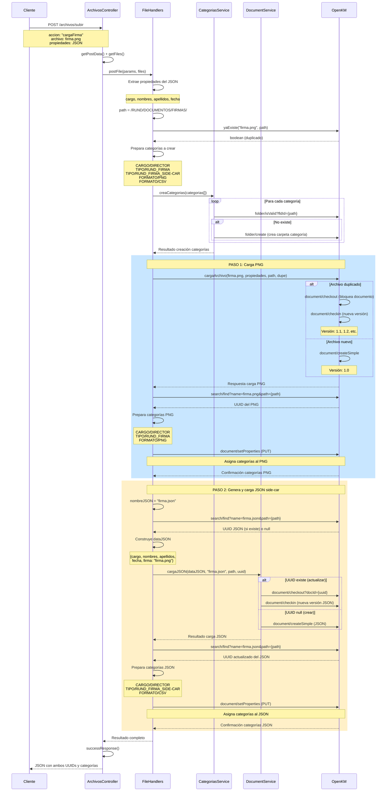
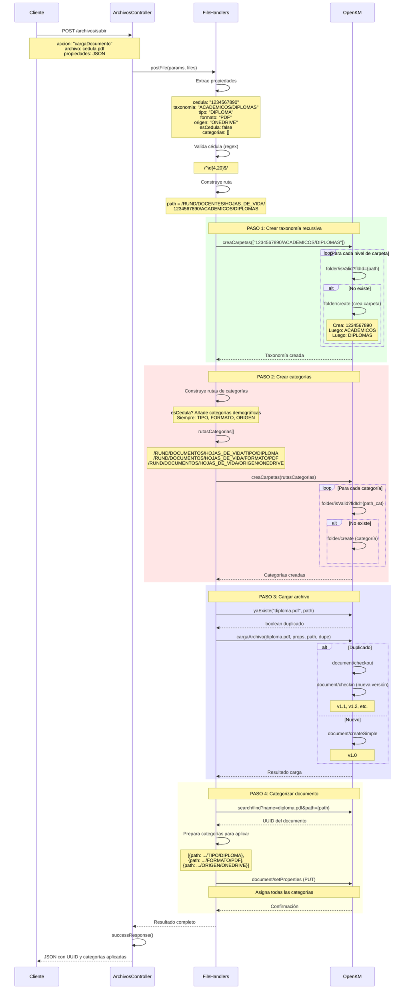
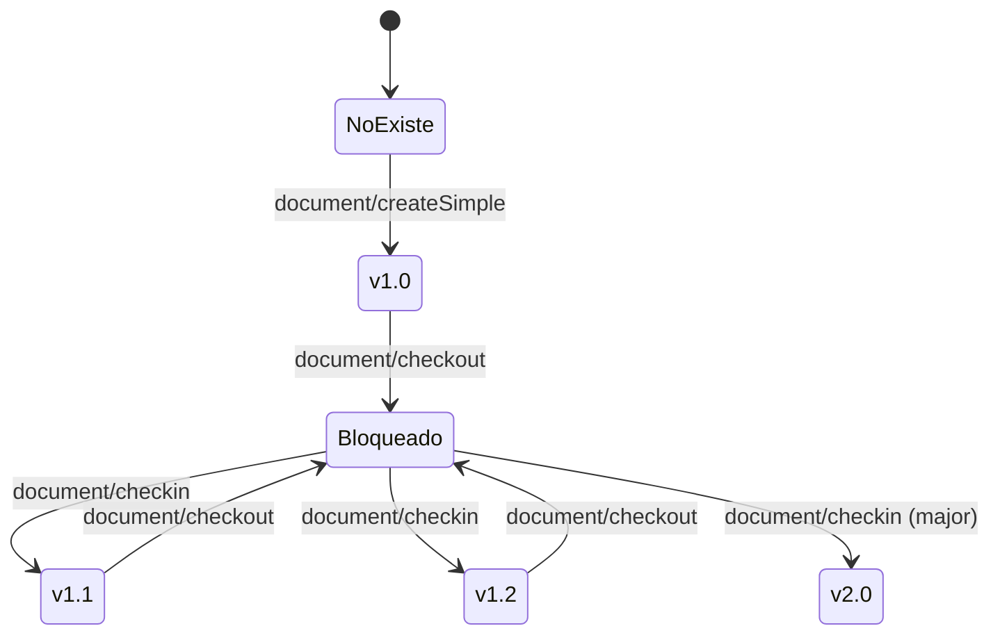

# 06. Flujos Críticos del Sistema RUND

Este documento detalla paso a paso los 3 flujos críticos más importantes del sistema RUND API v2, incluyendo diagramas Mermaid, ejemplos de código y payloads completos.

---

## 1. Generación de Certificado

**Endpoint:** `POST /api/v2/documentos/generar`
**Descripción:** Genera certificados personalizados en formato DOCX o PDF a partir de plantillas Word almacenadas en OpenKM.

### 1.1. Diagrama de Flujo



### 1.2. Clases y Métodos Involucrados

| Clase | Método | Responsabilidad |
|-------|--------|-----------------|
| `DocumentosController` | `generar()` | Punto de entrada, valida parámetros |
| `CertificadosHandlers` | `getCertificado()` | Orquesta el proceso completo |
| `CertificadosService` | `creaCertificado()` | Procesa plantilla DOCX |
| `CertificadosService` | `creaParrafo()` | Inserta texto simple |
| `CertificadosService` | `creaParrafoComplejo()` | Inserta texto con formato HTML |
| `CertificadosService` | `htmlToTextRun()` | Convierte HTML a TextRun de PhpWord |
| `CertificadosService` | `creaTabla()` | Clona filas y rellena tabla |
| `CertificadosService` | `creaFirma()` | Inserta firma e información |
| `QRService` | `creaQR()` | Genera código QR de validación |
| `FirmasService` | `creaFirmaTemp()` | Descarga firma desde OpenKM |
| `LBService` | `convierteWordToPDF()` | Convierte DOCX a PDF con LibreOffice |
| `DocumentService` | `addToJSON()` | Registra certificado en expedidos.json |
| `OpenKM` | `findArchivo()` | Busca archivo por nombre y ruta |
| `OpenKM` | `getArchivo()` | Descarga contenido por UUID |
| `Utils` | `generaID()` | Genera ID único de 16 caracteres |

### 1.3. Archivos Temporales Creados

Durante el proceso se crean archivos temporales en `/tmp/`:

1. **Plantilla descargada:** `plantilla.docx` (descargada de OpenKM)
2. **Firma temporal:** `firma_<uuid>.png` (descargada y eliminada inmediatamente)
3. **QR temporal:** `qr_<id>.png` (generado y eliminado inmediatamente)
4. **DOCX generado:** `certificado_YYYY-MM-DD-HH-mm-ss.docx` (solo para PDF)
5. **PDF final:** `certificado_YYYY-MM-DD-HH-mm-ss.pdf` (solo para PDF)

**Limpieza:** Todos los archivos temporales se eliminan después del envío al cliente.

### 1.4. Queries OpenKM Ejecutadas

```php
// 1. Buscar expedidos.json
"search/find?name=expedidos.json&path=/okm:root/RUND/DOCUMENTOS/CERTIFICADOS/"

// 2. Obtener contenido expedidos.json
"document/getContent?docId={uuid}"

// 3. Crear nueva versión de expedidos.json (si ID no existe)
"document/checkout?docId={uuid}"
"document/checkin?docId={uuid}"

// 4. Buscar plantilla DOCX
"search/find?name={plantilla}.docx&path=/okm:root/RUND/DOCUMENTOS/PLANTILLAS/CERTIFICADOS/"

// 5. Obtener contenido de plantilla
"document/getContent?docId={uuid_plantilla}"

// 6. Obtener firma PNG
"document/getContent?docId={uuid_firma}"
```

### 1.5. Ejemplo de Payload JSON (Entrada)

```json
{
  "tipo": "certificado",
  "plantilla": "certificado_laboral",
  "formato": "pdf",
  "id": "A1B2C3D4E5F6G7H8",
  "data": "[
    {
      \"tipo\": \"parrafo\",
      \"value\": \"La <strong>Escuela Superior de Administración Pública ESAP</strong> certifica que:\"
    },
    {
      \"tipo\": \"parrafo\",
      \"value\": \"<strong>JUAN CARLOS PÉREZ GARCÍA</strong>, identificado con cédula de ciudadanía No. <strong>1234567890</strong>, labora en esta institución desde el <em>15 de enero de 2020</em>.\"
    },
    {
      \"tipo\": \"tabla\",
      \"value\": {
        \"encabezados\": [\"CARGO\", \"FECHA_INICIO\", \"FECHA_FIN\"],
        \"filas\": [
          [\"Docente Catedrático\", \"2020-01-15\", \"2023-12-31\"],
          [\"Investigador\", \"2021-06-01\", \"Actualidad\"]
        ]
      }
    },
    {
      \"tipo\": \"parrafo\",
      \"value\": \"Se expide la presente certificación a solicitud del interesado para los fines que estime convenientes.\"
    },
    {
      \"tipo\": \"firma\",
      \"value\": {
        \"uuid\": \"e7f8g9h0-i1j2-k3l4-m5n6-o7p8q9r0s1t2\",
        \"nombre\": \"María Fernanda López\",
        \"cargo\": \"Directora de Talento Humano\"
      }
    }
  ]"
}
```

### 1.6. Ejemplo de Respuesta

**Formato DOCX:**
```
HTTP/1.1 200 OK
Content-Type: application/vnd.openxmlformats-officedocument.wordprocessingml.document
Content-Disposition: attachment; filename="certificado_laboral.docx"
Content-Transfer-Encoding: binary

[Contenido binario del archivo DOCX]
```

**Formato PDF:**
```
HTTP/1.1 200 OK
Content-Type: application/pdf
Content-Disposition: attachment; filename="certificado_2025-10-20-15-30-45.pdf"
Content-Length: 245678

[Contenido binario del archivo PDF]
```

### 1.7. Registro en expedidos.json

El sistema mantiene un registro de todos los certificados generados:

```json
[
  {
    "id": "A1B2C3D4E5F6G7H8",
    "tipo": "certificado",
    "plantilla": "certificado_laboral",
    "formato": "pdf",
    "data": "[...]",
    "timestamp": "2025-10-20T15:30:45-05:00"
  }
]
```

Este registro permite:
- Evitar duplicados (si se envía el mismo ID)
- Recuperar certificados previamente generados
- Validación en página web mediante QR

---

## 2. Subida de Archivo a OpenKM

**Endpoint:** `POST /api/v2/archivos/subir`
**Descripción:** Carga archivos al repositorio OpenKM con categorización automática y versionado.

### 2.1. Diagrama de Flujo General



### 2.2. Flujo A: Carga de Firma (PNG + JSON Side-Car)

Las firmas se almacenan como dos archivos vinculados:
1. **PNG:** Imagen de la firma
2. **JSON:** Metadatos (cargo, nombres, apellidos, fecha)



#### 2.2.1. Ejemplo de Payload - Carga de Firma

```json
{
  "accion": "cargaFirma",
  "propiedades": "[
    {\"label\": \"cargo\", \"valor\": \"Director Académico\"},
    {\"label\": \"nombres\", \"valor\": \"Carlos Andrés\"},
    {\"label\": \"apellidos\", \"valor\": \"Rodríguez Pérez\"},
    {\"label\": \"fecha\", \"valor\": \"2025-10-20\"}
  ]",
  "archivo": "[Archivo binario firma.png]"
}
```

#### 2.2.2. Estructura en OpenKM - Firmas

```
/okm:root/RUND/DOCUMENTOS/FIRMAS/
├── firma_director_academico.png  [UUID: abc123...]
│   └── Categorías:
│       ├── /okm:categories/RUND/DOCUMENTOS/FIRMAS/CARGO/DIRECTOR_ACADEMICO
│       ├── /okm:categories/RUND/DOCUMENTOS/FIRMAS/TIPO/RUND_FIRMA
│       └── /okm:categories/RUND/DOCUMENTOS/FIRMAS/FORMATO/PNG
│
└── firma_director_academico.json [UUID: def456...]
    └── Categorías:
        ├── /okm:categories/RUND/DOCUMENTOS/FIRMAS/CARGO/DIRECTOR_ACADEMICO
        ├── /okm:categories/RUND/DOCUMENTOS/FIRMAS/TIPO/RUND_FIRMA_SIDE-CAR
        └── /okm:categories/RUND/DOCUMENTOS/FIRMAS/FORMATO/CSV
```

#### 2.2.3. Contenido JSON Side-Car

```json
[
  {"label": "cargo", "valor": "Director Académico"},
  {"label": "nombres", "valor": "Carlos Andrés"},
  {"label": "apellidos", "valor": "Rodríguez Pérez"},
  {"label": "fecha", "valor": "2025-10-20"},
  {"label": "firma", "valor": "firma_director_academico.png"}
]
```

### 2.3. Flujo B: Carga de Documento (Hoja de Vida)

Los documentos se organizan por cédula del profesor con estructura jerárquica.



#### 2.3.1. Ejemplo de Payload - Carga de Cédula (Documento Demográfico)

```json
{
  "accion": "cargaDocumento",
  "propiedades": "[
    {\"label\": \"cedula\", \"valor\": \"1234567890\"},
    {\"label\": \"taxonomia\", \"valor\": \"\"},
    {\"label\": \"tipo\", \"valor\": \"CEDULA\"},
    {\"label\": \"formato\", \"valor\": \"PDF\"},
    {\"label\": \"origen\", \"valor\": \"SCANNER\"},
    {\"label\": \"esCedula\", \"valor\": true},
    {\"label\": \"categorias\", \"valor\": [
      \"GENERO/MASCULINO\",
      \"EDAD/30-40\",
      \"ESTADO_CIVIL/SOLTERO\",
      \"NIVEL_EDUCATIVO/MAESTRIA\"
    ]}
  ]",
  "archivo": "[Archivo binario cedula.pdf]"
}
```

#### 2.3.2. Ejemplo de Payload - Carga de Documento Regular

```json
{
  "accion": "cargaDocumento",
  "propiedades": "[
    {\"label\": \"cedula\", \"valor\": \"1234567890\"},
    {\"label\": \"taxonomia\", \"valor\": \"ACADEMICOS/DIPLOMAS\"},
    {\"label\": \"tipo\", \"valor\": \"DIPLOMA\"},
    {\"label\": \"formato\", \"valor\": \"PDF\"},
    {\"label\": \"origen\", \"valor\": \"ONEDRIVE\"},
    {\"label\": \"esCedula\", \"valor\": false}
  ]",
  "archivo": "[Archivo binario diploma_maestria.pdf]"
}
```

#### 2.3.3. Estructura en OpenKM - Documentos

```
/okm:root/RUND/DOCENTES/HOJAS_DE_VIDA/
└── 1234567890/                         [Carpeta por cédula]
    ├── cedula.pdf                      [Documento demográfico]
    │   └── Categorías:
    │       ├── /RUND/DOCENTES/GENERO/MASCULINO
    │       ├── /RUND/DOCENTES/EDAD/30-40
    │       ├── /RUND/DOCENTES/ESTADO_CIVIL/SOLTERO
    │       ├── /RUND/DOCENTES/NIVEL_EDUCATIVO/MAESTRIA
    │       ├── /RUND/DOCUMENTOS/HOJAS_DE_VIDA/TIPO/CEDULA
    │       ├── /RUND/DOCUMENTOS/HOJAS_DE_VIDA/FORMATO/PDF
    │       └── /RUND/DOCUMENTOS/HOJAS_DE_VIDA/ORIGEN/SCANNER
    │
    ├── ACADEMICOS/
    │   ├── DIPLOMAS/
    │   │   └── diploma_maestria.pdf
    │   │       └── Categorías:
    │   │           ├── /RUND/DOCUMENTOS/HOJAS_DE_VIDA/TIPO/DIPLOMA
    │   │           ├── /RUND/DOCUMENTOS/HOJAS_DE_VIDA/FORMATO/PDF
    │   │           └── /RUND/DOCUMENTOS/HOJAS_DE_VIDA/ORIGEN/ONEDRIVE
    │   │
    │   └── ACTAS/
    │       └── acta_grado.pdf
    │
    └── LABORALES/
        └── CONTRATOS/
            └── contrato_2024.pdf
```

### 2.4. Sistema de Versionado OpenKM

OpenKM maneja versiones automáticamente mediante checkout/checkin:



**Importante:**
- **Checkout:** Bloquea el documento para edición
- **Checkin:** Guarda nueva versión y desbloquea
- **Mensaje de versión:** Se registra con cada checkin
- **Historial completo:** OpenKM mantiene todas las versiones

### 2.5. Ejemplo de Respuesta Exitosa

```json
{
  "success": true,
  "data": {
    "archivo": {
      "creaTaxonomia": "OK",
      "creaCategorias": "OK",
      "carga": {
        "documento": {
          "uuid": "f7e6d5c4-b3a2-9180-7f6e-5d4c3b2a1098",
          "version": "1.0",
          "path": "/okm:root/RUND/DOCENTES/HOJAS_DE_VIDA/1234567890/ACADEMICOS/DIPLOMAS/diploma_maestria.pdf",
          "size": 245678
        }
      },
      "setProperties": "OK"
    },
    "meta": {
      "accion": "cargaDocumento",
      "nombre_original": "diploma_maestria.pdf",
      "tamaño": 245678,
      "version": "2.0"
    }
  }
}
```

---

## 3. Consulta de Información de Profesor

**Endpoint:** `GET /api/v2/profesores/{cedula}`
**Descripción:** Obtiene información completa del profesor incluyendo datos demográficos y archivos asociados.

### 3.1. Diagrama de Flujo

```mermaid
sequenceDiagram
    participant Client as Cliente
    participant PC as ProfesoresController
    participant DH as DataHandlers
    participant DS as DocumentService
    participant OKM as OpenKM

    Client->>PC: GET /api/v2/profesores/1234567890

    PC->>PC: Valida parámetro cedula
    PC->>DH: getInfoProfesor("1234567890")

    DH->>DH: Valida formato cédula
    Note over DH: regex: /^\d{4,20}$/

    rect rgb(255, 240, 240)
        Note over DH,OKM: PASO 1: Obtener archivos del profesor
        DH->>DS: getInfoArchivosProfesor(cedula, false)
        Note over DH,DS: false = TODOS los archivos

        DS->>DS: Construye query sin filtro de nombre
        Note over DS: path=/RUND/DOCENTES/HOJAS_DE_VIDA/1234567890

        DS->>OKM: search/find?path={path}
        Note over DS,OKM: Busca TODOS los documentos<br/>en la carpeta del profesor

        OKM-->>DS: queryResult[] (array de nodos)

        loop Para cada nodo en queryResult
            DS->>DS: extraeDatosDocumento(nodo)

            Note over DS: Extrae nombre del archivo
            DS->>DS: path.replace(TAX_HOJAS)
            DS->>DS: Divide por "/" y toma último elemento

            Note over DS: Extrae categorías del documento
            loop Para cada categoría en nodo.categories
                DS->>DS: Filtra por CTGR_DOCS_HOJAS
                DS->>DS: Divide path categoría en partes
                Note over DS: [TIPO, DIPLOMA]<br/>[FORMATO, PDF]<br/>[ORIGEN, ONEDRIVE]
            end

            DS->>DS: Agrega al array datos[]
        end

        DS-->>DH: Array con info de todos los archivos
    end

    rect rgb(240, 255, 240)
        Note over DH,OKM: PASO 2: Obtener datos demográficos
        DH->>DS: getInfoArchivosProfesor(cedula, true)
        Note over DH,DS: true = Solo cédula (datos demográficos)

        DS->>DS: Construye query con filtro
        Note over DS: path=.../1234567890<br/>name=cedula

        DS->>OKM: search/find?path={path}&name=cedula
        Note over DS,OKM: Busca específicamente<br/>archivo "cedula"

        OKM-->>DS: queryResult.node (único nodo)

        DS->>DS: extraeDatosDocumento(nodo)

        Note over DS: Extrae categorías demográficas
        loop Para cada categoría
            DS->>DS: Filtra por ROOT_CTG_PROF
            Note over DS: Solo categorías demográficas:<br/>GENERO, EDAD, ESTADO_CIVIL, etc.
            DS->>DS: Divide en partes [tipo, valor]
        end

        DS-->>DH: Datos demográficos con categorías
    end

    rect rgb(240, 240, 255)
        Note over DH,OKM: PASO 3: Estructurar categorías demográficas
        DH->>OKM: getDataFile("labels")
        Note over DH,OKM: Obtiene labels.json<br/>para traducir códigos

        OKM->>OKM: findArchivo("labels.json")
        OKM->>OKM: getArchivo(uuid)
        OKM-->>DH: Contenido labels.json

        DH->>DS: estructuraCategorias(categorias)

        loop Para cada categoría [tipo, valor]
            DS->>DS: labels[tipo] -> "Género"
            DS->>DS: labels[valor] -> "Masculino"

            alt Categoría de 3 niveles
                Note over DS: [PROGRAMAS, MAESTRIA, ADMINISTRACION]
                DS->>DS: Agrupa por tipo y subtipo
                Note over DS: resultado[Programas][Maestría] = "Administración"
            else Categoría de 2 niveles
                Note over DS: [GENERO, MASCULINO]
                DS->>DS: Agrupa por tipo
                Note over DS: resultado[Género][] = "Masculino"
            end
        end

        DS-->>DH: Categorías estructuradas jerárquicamente
    end

    DH->>DH: Construye respuesta final
    Note over DH: {archivosProfesor: [...],<br/>datosDemograficos: {...}}

    DH-->>PC: Información completa

    PC->>PC: successResponse()
    PC->>PC: Añade metadatos
    Note over PC: total_archivos<br/>incluye_demografia<br/>version: 2.0

    PC-->>Client: JSON con toda la información
```



### 3.2. Queries OpenKM Ejecutadas

```php
// 1. Buscar todos los archivos del profesor
"search/find?path=/okm:root/RUND/DOCENTES/HOJAS_DE_VIDA/1234567890"

// 2. Buscar específicamente el archivo de cédula
"search/find?path=/okm:root/RUND/DOCENTES/HOJAS_DE_VIDA/1234567890&name=cedula"

// 3. Obtener archivo labels.json (para traducción)
"search/find?name=labels.json&path=/okm:root/RUND/CONFIG/DATA/"
"document/getContent?docId={uuid_labels}"
```

### 3.3. Transformación de Categorías

El sistema transforma las categorías de OpenKM a una estructura legible:

```php
// INPUT: Categorías crudas de OpenKM
[
  ["GENERO", "MASCULINO"],
  ["EDAD", "30-40"],
  ["ESTADO_CIVIL", "SOLTERO"],
  ["PROGRAMAS", "MAESTRIA", "ADMINISTRACION"],
  ["PROGRAMAS", "MAESTRIA", "GESTION_PUBLICA"],
  ["NIVEL_EDUCATIVO", "MAESTRIA"]
]

// PROCESO: Lookup en labels.json
{
  "GENERO": "Género",
  "MASCULINO": "Masculino",
  "EDAD": "Edad",
  "30-40": "30 a 40 años",
  "ESTADO_CIVIL": "Estado Civil",
  "SOLTERO": "Soltero",
  "PROGRAMAS": "Programas",
  "MAESTRIA": "Maestría",
  "ADMINISTRACION": "Administración Pública",
  "GESTION_PUBLICA": "Gestión Pública",
  "NIVEL_EDUCATIVO": "Nivel Educativo"
}

// OUTPUT: Estructura jerárquica legible
{
  "Género": ["Masculino"],
  "Edad": ["30 a 40 años"],
  "Estado Civil": ["Soltero"],
  "Programas": {
    "Maestría": ["Administración Pública", "Gestión Pública"]
  },
  "Nivel Educativo": ["Maestría"]
}
```

### 3.4. Ejemplo de Respuesta Completa

```json
{
  "success": true,
  "data": {
    "profesor": {
      "archivosProfesor": [
        {
          "nombre": "cedula.pdf",
          "categorias": [
            ["TIPO", "CEDULA"],
            ["FORMATO", "PDF"],
            ["ORIGEN", "SCANNER"]
          ]
        },
        {
          "nombre": "diploma_maestria.pdf",
          "categorias": [
            ["TIPO", "DIPLOMA"],
            ["FORMATO", "PDF"],
            ["ORIGEN", "ONEDRIVE"]
          ]
        },
        {
          "nombre": "contrato_2024.pdf",
          "categorias": [
            ["TIPO", "CONTRATO"],
            ["FORMATO", "PDF"],
            ["ORIGEN", "SCANNER"]
          ]
        },
        {
          "nombre": "certificado_bancario.pdf",
          "categorias": [
            ["TIPO", "CERTIFICADO_BANCARIO"],
            ["FORMATO", "PDF"],
            ["ORIGEN", "EMAIL"]
          ]
        }
      ],
      "datosDemograficos": {
        "nombre": "cedula.pdf",
        "categorias": {
          "Género": ["Masculino"],
          "Edad": ["30 a 40 años"],
          "Estado Civil": ["Soltero"],
          "Nivel Educativo": ["Maestría"],
          "Programas": {
            "Maestría": [
              "Administración Pública",
              "Gestión Pública"
            ]
          },
          "Departamento": ["Cundinamarca"],
          "Ciudad": ["Bogotá D.C."],
          "Tipo Documento": ["Cédula de Ciudadanía"]
        }
      }
    },
    "cedula": "1234567890",
    "meta": {
      "total_archivos": 4,
      "incluye_demografia": true,
      "version": "2.0"
    }
  }
}
```

### 3.5. Procesamiento de Categorías Múltiples

Cuando un documento tiene múltiples valores para la misma categoría:

```php
// Categorías de entrada
[
  ["PROGRAMAS", "MAESTRIA", "ADMINISTRACION"],
  ["PROGRAMAS", "MAESTRIA", "GESTION_PUBLICA"],
  ["PROGRAMAS", "DOCTORADO", "CIENCIAS_POLITICAS"]
]

// Primera iteración: establece valor único
resultado["Programas"]["Maestría"] = "Administración Pública"

// Segunda iteración: detecta duplicado y convierte a array
resultado["Programas"]["Maestría"] = [
  "Administración Pública"  // valor anterior
]
resultado["Programas"]["Maestría"][] = "Gestión Pública"  // nuevo valor

// Tercera iteración: nueva subcategoría
resultado["Programas"]["Doctorado"] = "Ciencias Políticas"

// Resultado final
{
  "Programas": {
    "Maestría": [
      "Administración Pública",
      "Gestión Pública"
    ],
    "Doctorado": "Ciencias Políticas"
  }
}
```

### 3.6. Endpoints Relacionados

El sistema ofrece endpoints especializados para acceso parcial:

```http
# Información completa (datos + archivos)
GET /api/v2/profesores/1234567890

# Solo archivos (sin datos demográficos)
GET /api/v2/profesores/1234567890/archivos

# Solo datos demográficos
GET /api/v2/profesores/1234567890/demografia
```

**Respuesta solo archivos:**
```json
{
  "success": true,
  "data": {
    "archivos": [...],
    "cedula": "1234567890",
    "estadisticas": {
      "por_tipo": {
        "DIPLOMA": 2,
        "CONTRATO": 1,
        "CERTIFICADO_BANCARIO": 1
      },
      "por_formato": {
        "PDF": 4
      },
      "por_origen": {
        "ONEDRIVE": 2,
        "SCANNER": 1,
        "EMAIL": 1
      }
    },
    "meta": {
      "total": 4,
      "endpoint": "archivos",
      "version": "2.0"
    }
  }
}
```

---

## Resumen de Archivos Clave

| Archivo | Propósito | Ubicación |
|---------|-----------|-----------|
| `DocumentosController.php` | Maneja generación de documentos | `/app/src/Controllers/V2/` |
| `ArchivosController.php` | Maneja subida/descarga de archivos | `/app/src/Controllers/V2/` |
| `ProfesoresController.php` | Maneja consultas de profesores | `/app/src/Controllers/V2/` |
| `CertificadosHandlers.php` | Orquesta generación de certificados | `/app/src/Handlers/` |
| `FileHandlers.php` | Orquesta operaciones de archivos | `/app/src/Handlers/` |
| `DataHandlers.php` | Orquesta consultas de datos | `/app/src/Handlers/` |
| `CertificadosService.php` | Procesa plantillas DOCX | `/app/src/Services/` |
| `DocumentService.php` | Operaciones con documentos OpenKM | `/app/src/Services/` |
| `QRService.php` | Generación de códigos QR | `/app/src/Services/` |
| `FirmasService.php` | Gestión de firmas digitales | `/app/src/Services/` |
| `LBService.php` | Conversión DOCX/XLSX a PDF | `/app/src/Services/` |
| `OpenKM.php` | Cliente REST de OpenKM | `/app/src/Core/` |
| `Config.php` | Constantes y rutas del sistema | `/app/src/Config/` |

---

## Notas Importantes

1. **Temporales:** Todos los archivos en `/tmp/` se eliminan después de procesarse
2. **Versionado:** OpenKM mantiene historial completo de versiones
3. **Categorización:** Automática según propiedades del archivo
4. **Validación:** Cédulas deben ser numéricas (4-20 dígitos)
5. **Formato QR:** ID debe ser exactamente 16 caracteres alfanuméricos
6. **LibreOffice:** Conversión a PDF ejecuta en modo headless
7. **Side-car:** Firmas siempre tienen PNG + JSON vinculado
8. **Labels:** Sistema de traducción jerárquico para categorías
9. **Seguridad:** Autenticación básica con OpenKM (usuario/contraseña)
10. **Timeout:** Conexiones OpenKM con timeout de 30 segundos

---

**Documento generado:** 2025-10-20
**Versión API:** 2.0
**Autor:** ESAP Development Team
